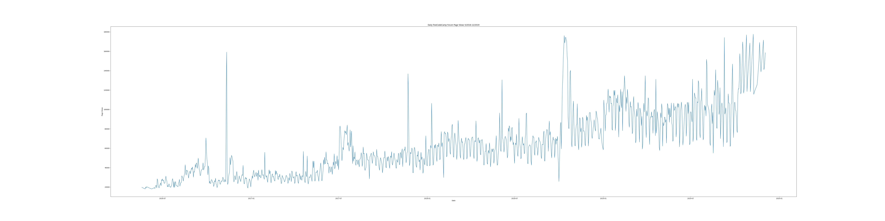
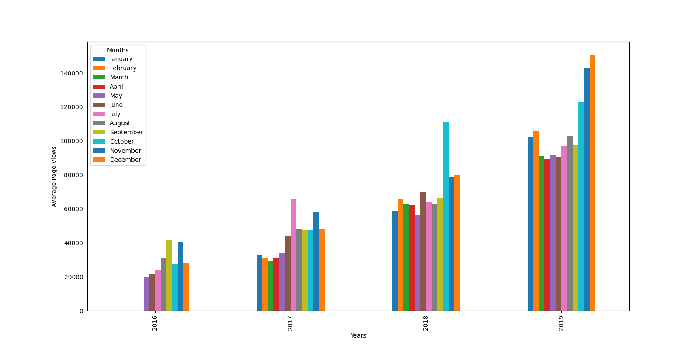
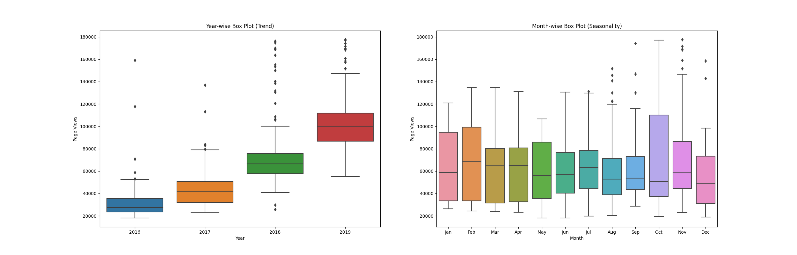

# page-view-time-series-visualizer

### Data analysis on page views of the freeCodeCamp forum.

The first graph shows the distribution of the number of page views over time. 
 

The second graph shows the average daily page views for each month grouped by year. 
 

The third and fourth graphs show how the values are distributed within a given year or month and how it compares over time. 

